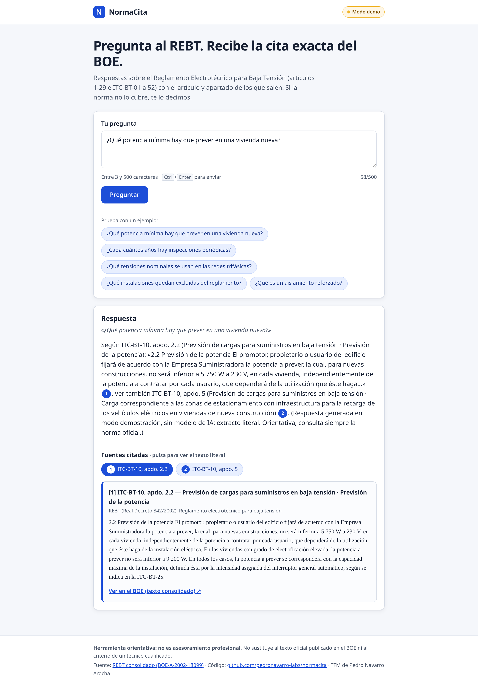
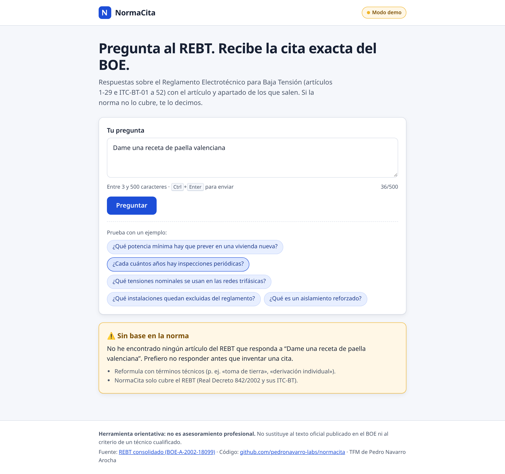
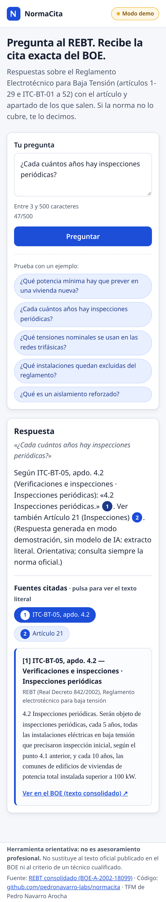

# NormaCita · Normativa técnica con citas verificables

> Proyecto Final (TFM) del **Máster en Desarrollo con IA** (The Big School) · Autor: **Pedro Navarro Arocha**
> Estado: 🚧 v0.2 — corpus REBT completo, evaluación automática en CI y despliegue preparado. Funciona de extremo a extremo en modo demo; ver [ROADMAP](docs/ROADMAP.md).

| Enlace | URL |
|---|---|
| 🌐 Demo desplegada | `PENDIENTE — https://…` (pasos en [DEPLOY.md](DEPLOY.md)) |
| 📊 Slides (públicas) | `PENDIENTE — https://…` |
| 🎬 Vídeo de presentación | `PENDIENTE — https://…` |
| 💻 Repositorio | https://github.com/pedronavarro-labs/normacita |

## a. Descripción general
Quienes trabajan con normativa técnica pierden tiempo buscando **qué artículo exacto** regula algo, y los chats de IA genéricos responden sin citar o inventan artículos. **NormaCita** responde preguntas en lenguaje natural **siempre con citas numeradas** al artículo y apartado del texto consolidado del BOE, con el fragmento literal y su enlace. Si el corpus no cubre la pregunta, **lo dice y no responde**.

Corpus inicial: **Reglamento Electrotécnico para Baja Tensión (REBT)**, Real Decreto 842/2002 ([BOE-A-2002-18099](https://www.boe.es/buscar/act.php?id=BOE-A-2002-18099)). La v0.2 incluye la norma **completa**: articulado del Real Decreto (arts. 1-29) y las **52 ITC-BT**, troceadas por apartado en 832 fragmentos (`data/corpus/rebt.json`), generadas desde el XML oficial de la API de datos abiertos del BOE (`data/raw/rebt/`).

> ⚠️ Herramienta orientativa: no sustituye al texto oficial ni al criterio profesional.

### Capturas (modo demo, sin LLM)
| Inicio | Respuesta con citas desplegadas |
|---|---|
|  |  |
| **Sin base en la norma** | **Móvil** |
|  |  |

Más: [error del servicio de IA](docs/img/05-error.png) · [validación de la pregunta](docs/img/06-validacion.png) · [inicio en móvil](docs/img/04a-movil-inicio.png).

## b. Stack tecnológico
| Capa | Tecnología | Por qué |
|---|---|---|
| Backend / API | Python 3.11+, **FastAPI**, Pydantic v2, Uvicorn | Ecosistema IA en Python, validación tipada, OpenAPI automático |
| Recuperación (RAG) | BM25 propio en Python puro (stemming ligero, campo título, umbral de cobertura) | Determinista, gratis y testeable ([ADR-0003](docs/adr/ADR-0003-recuperacion-bm25-primero.md)) |
| IA generativa | Cualquier API **OpenAI-compatible** (Gemini, Groq, OpenRouter, Ollama) vía httpx · proveedor **fake** sin claves | Proveedor intercambiable por entorno ([ADR-0002](docs/adr/ADR-0002-proveedor-llm-intercambiable.md)) |
| Frontend | HTML + CSS + JavaScript sin framework, responsive y accesible (teclado, foco visible, ARIA) | Mínimo y seguro (CSP estricta, sin `innerHTML`, sin scripts ni estilos en línea) |
| Calidad | pytest + pytest-cov, ruff (lint + formato + reglas de seguridad) | |
| Infra | Docker (usuario no root), GitHub Actions (CI), despliegue previsto en Render/Fly.io | |
| Datos | API de datos abiertos del BOE → JSON | Fuente oficial y pública |

Arquitectura hexagonal; diagramas en [docs/ARQUITECTURA.md](docs/ARQUITECTURA.md).

## c. Instalación y ejecución

**Requisitos:** Python ≥ 3.11 (o Docker). Recomendado: [uv](https://docs.astral.sh/uv/).

```bash
# 1. Entorno e instalación (con uv)
uv venv .venv && source .venv/bin/activate
uv pip install -e ".[dev]"
#    (alternativa sin uv: python -m venv .venv && source .venv/bin/activate && pip install -e ".[dev]")

# 2. Configuración (por defecto modo demo, sin claves)
cp .env.example .env
set -a && source .env && set +a      # carga las variables en la sesión

# 3. Arrancar
uvicorn normacita.main:app --reload
# → http://localhost:8000  (UI)  ·  http://localhost:8000/docs  (OpenAPI)

# 4. Calidad
ruff format --check . && ruff check .
pytest
```

**Con un LLM real** (edita `.env`; nunca subas ese archivo):
```bash
LLM_PROVIDER=openai_compatible
LLM_BASE_URL=https://generativelanguage.googleapis.com/v1beta/openai   # ejemplo: Gemini
LLM_API_KEY=tu_clave
LLM_MODEL=nombre-del-modelo
```

**Con Docker:**
```bash
docker build -t normacita .
docker run --rm -p 8000:8000 --env-file .env normacita
```

**Regenerar el corpus desde el BOE** (dos pasos: XML crudo → JSON):
```bash
python scripts/ingest_boe.py descargar      # guarda el XML oficial en data/raw/rebt/
python scripts/ingest_boe.py construir      # genera data/corpus/rebt.json (añade --sin-itc para solo el articulado)
```
Si tu red no llega a `boe.es`, lanza el workflow manual **«Ingesta BOE (manual)»** en GitHub Actions y descarga el artefacto `corpus-boe` (`gh run download`).

**Evaluación de calidad** (52 preguntas, proveedor fake, también en CI):
```bash
python -m normacita.evaluation       # hit@1, hit@3, cobertura y acierto en negativas
```
Resultados y metodología en [docs/EVALUACION.md](docs/EVALUACION.md): hit@1 0.714 · hit@3 0.952 · negativas 1.00 (validación: 0.50 / 0.917 / 1.00).

**Despliegue:** preparado para Render (`render.yaml`, plan free, modo demo por defecto) con alternativa en Fly.io. Paso a paso y claves gratuitas de LLM en [DEPLOY.md](DEPLOY.md).

## d. Estructura del proyecto
```
normacita/
├── src/normacita/
│   ├── domain/            # Modelos de negocio (Fragment, Citation, Answer). Sin dependencias.
│   ├── application/       # Puertos (Retriever, LLMProvider) y caso de uso AskQuestion
│   ├── infrastructure/    # Adaptadores: corpus JSON, BM25, proveedores LLM (fake / OpenAI-compatible)
│   ├── api/               # FastAPI: endpoints, validación, seguridad, UI estática
│   ├── config.py          # Configuración desde variables de entorno
│   └── main.py            # Punto de entrada ASGI
├── data/raw/rebt/         # XML oficial del BOE (82 ficheros: índice + 29 artículos + 52 ITC)
├── data/corpus/rebt.json  # Corpus REBT completo troceado por apartado
├── eval/preguntas.json    # 52 preguntas de evaluación con la cita esperada
├── scripts/ingest_boe.py  # Ingesta desde la API de datos abiertos del BOE
├── tests/                 # 57 tests (unitarios, API, UI, ingesta y evaluación), sin red ni claves
├── docs/                  # Especificación, arquitectura, ADRs, evaluación, capturas (img/), presentación, registro de IA
├── .github/workflows/     # CI (lint, tests, Docker) + ingesta BOE manual
├── Dockerfile · render.yaml · DEPLOY.md · .env.example · AGENTS.md · pyproject.toml
```

## e. Funcionalidades principales
- ✅ Pregunta en lenguaje natural → respuesta con **citas numeradas** [n] al artículo y apartado.
- ✅ Citas como *chips* clicables (y marcadores [n] en el texto) que despliegan el texto literal del BOE y su enlace.
- ✅ Preguntas de ejemplo, estado de carga, estados claros de «sin base en la norma» y de error, insignia «Modo demo».
- ✅ **«Sin base normativa»**: si nada relevante supera los umbrales de puntuación y cobertura, no responde ni llama al LLM.
- ✅ Corpus REBT completo (arts. 1-29 + ITC-BT-01…52) desde el XML oficial del BOE.
- ✅ Evaluación automática en CI (hit@1/hit@3 de la cita y acierto en negativas).
- ✅ Validación de citas: se eliminan los marcadores que el modelo invente.
- ✅ Proveedor de IA intercambiable (modo demo sin claves).
- ✅ Seguridad: validación de entradas, rate limit por IP, CSP y cabeceras, errores genéricos.
- ⏳ Despliegue público (preparado) · LLM real en producción · búsqueda híbrida · feedback 👍/👎.

API:
| Método | Ruta | Descripción |
|---|---|---|
| GET | `/health` | Estado y proveedor activo |
| POST | `/api/ask` | `{"pregunta": "..."}` → `{respuesta, citas[], sin_base, proveedor}` |
| GET | `/` | Interfaz web |

## f. Usuario y contraseña de prueba
No aplica en la v0.2: la app es pública y **no tiene login**. Si se añade el panel de administración (HU-14), aquí irán las credenciales de prueba.

---
Licencia: `PENDIENTE de elegir` · Uso de IA en el desarrollo: [docs/REGISTRO-IA.md](docs/REGISTRO-IA.md) · Reglas para agentes: [AGENTS.md](AGENTS.md)
