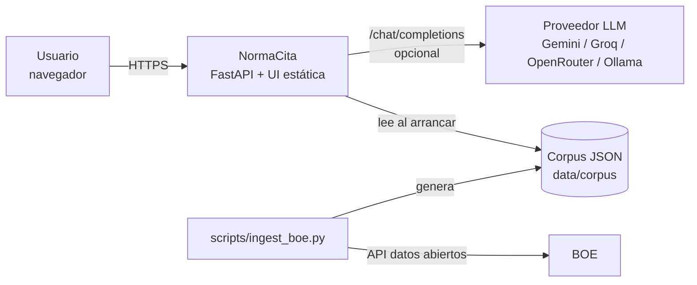
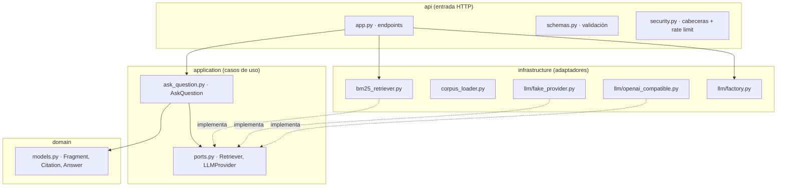
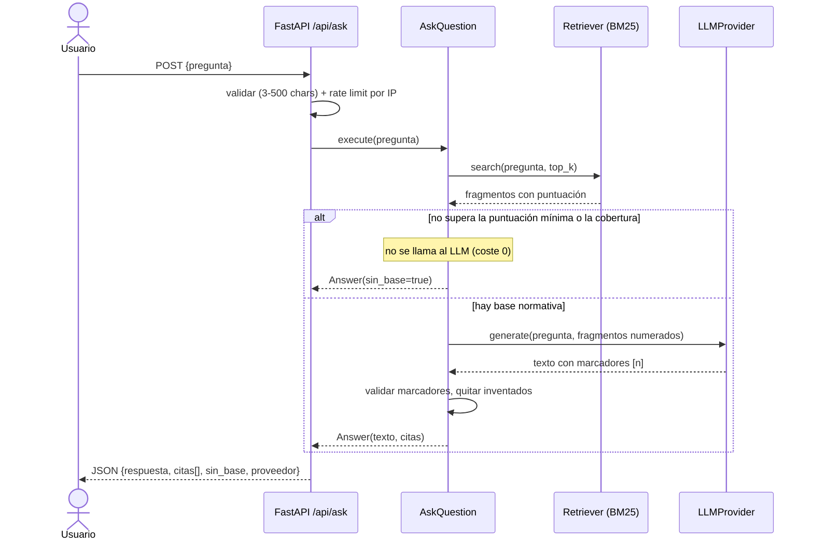
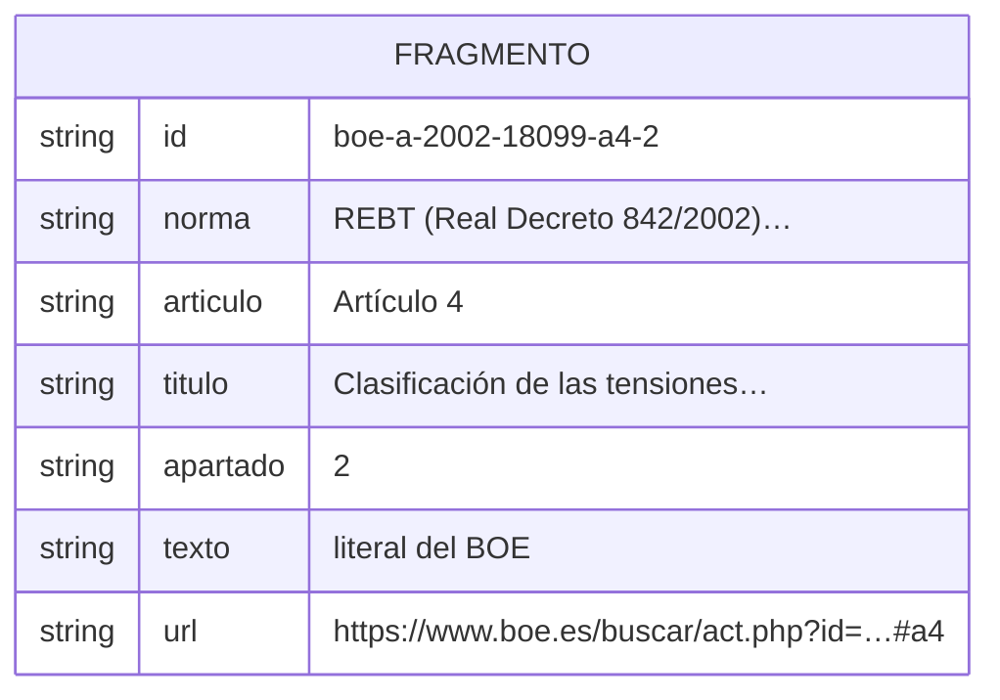
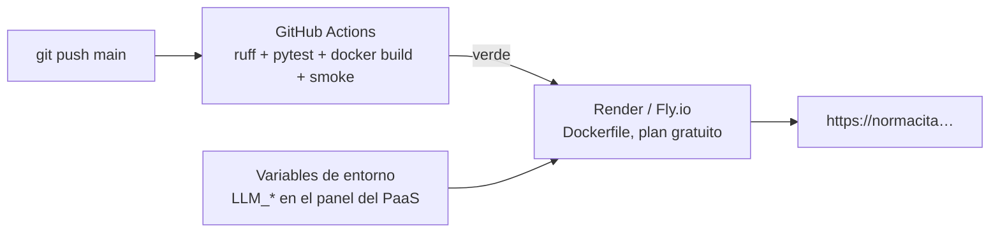

# Arquitectura — NormaCita

## 1. Visión general (C4 nivel 1-2)

- **Un único servicio** (monolito modular): fácil de desplegar gratis y suficiente para el MVP.
- El LLM es **opcional**: sin él, el proveedor *fake* responde con extractos literales.

## 2. Capas (arquitectura hexagonal / Clean Architecture)

**Regla de dependencias:** las flechas siempre apuntan hacia dentro. `domain` no importa nada; `application` solo depende de `domain` y de sus propios puertos; la infraestructura implementa los puertos. Por eso se cambia de LLM o de buscador sin tocar el caso de uso, y los tests usan dobles sin red.

## 3. Flujo de una pregunta (secuencia)

## 4. Modelo de datos (corpus)

Granularidad = **apartado** de artículo: la cita es precisa y el fragmento cabe holgado en el contexto del LLM.

## 5. Seguridad (resumen; detalle en ADR-0004)
| Amenaza | Control |
|---|---|
| Prompt injection directa (pregunta) o indirecta (texto del corpus) — OWASP LLM01 | Prompt de sistema que trata fragmentos y pregunta como datos delimitados `<<< >>>`; corpus solo de fuente oficial |
| Salida no fiable — LLM05 | La UI inserta todo con `textContent`; enlaces solo `https://`; CSP `default-src 'self'` |
| Citas inventadas / desinformación — LLM09 | Validación de marcadores [n]; umbral «sin base»; aviso de orientativo |
| Consumo ilimitado — LLM10 | Rate limit por IP, `max_tokens`, sin LLM cuando no hay base |
| Fuga de secretos | Claves solo por entorno, `repr=False`, errores genéricos (502) |
| Clickjacking / MIME sniffing | `X-Frame-Options: DENY`, `frame-ancestors 'none'`, `nosniff` |

## 6. Despliegue

- La imagen corre con usuario no root y lee `PORT` del entorno.
- Limitación conocida: el rate limit es en memoria (1 instancia). Con varias réplicas → Redis.

## 7. Estructura de carpetas
Ver README §d.
