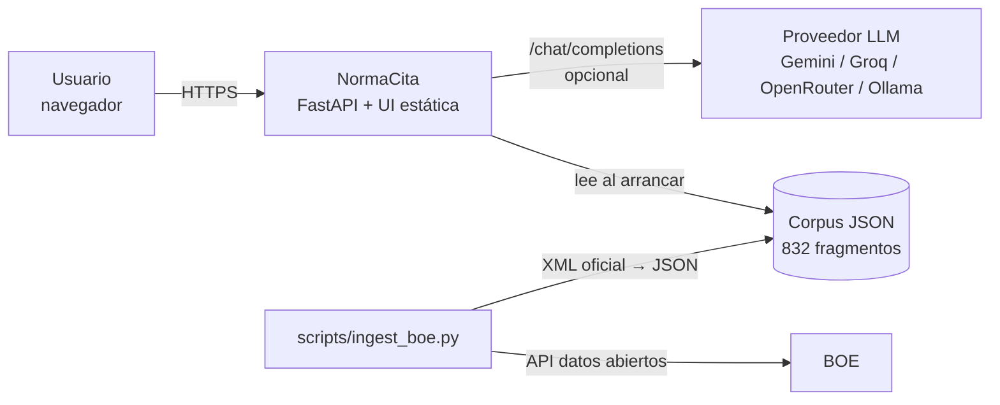
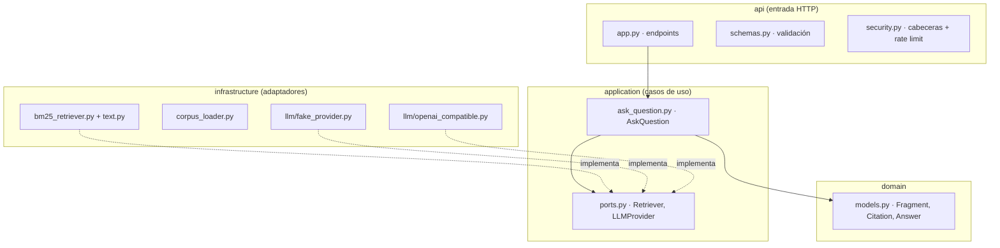
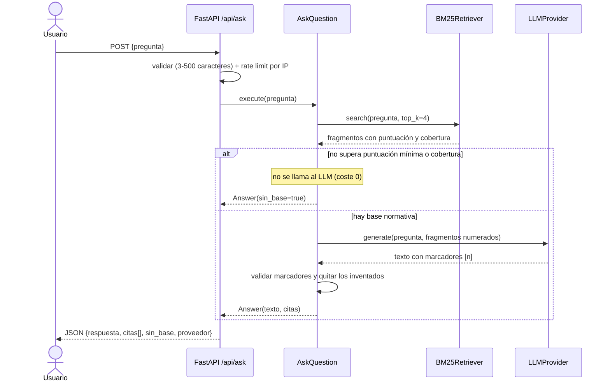
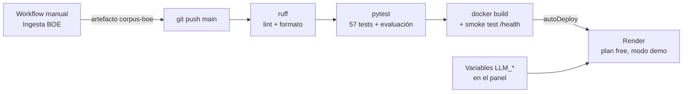
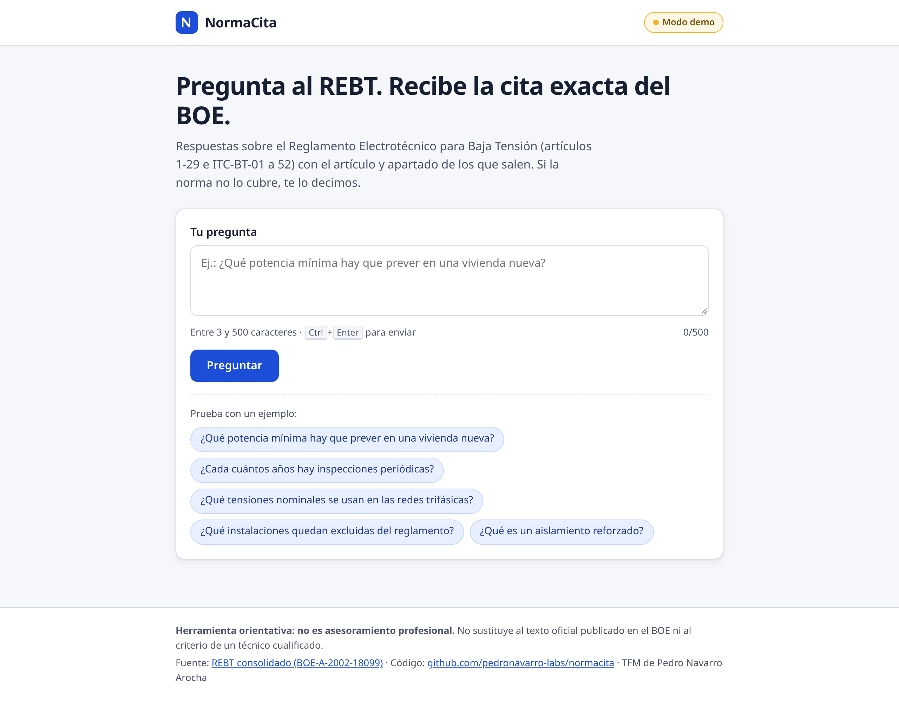
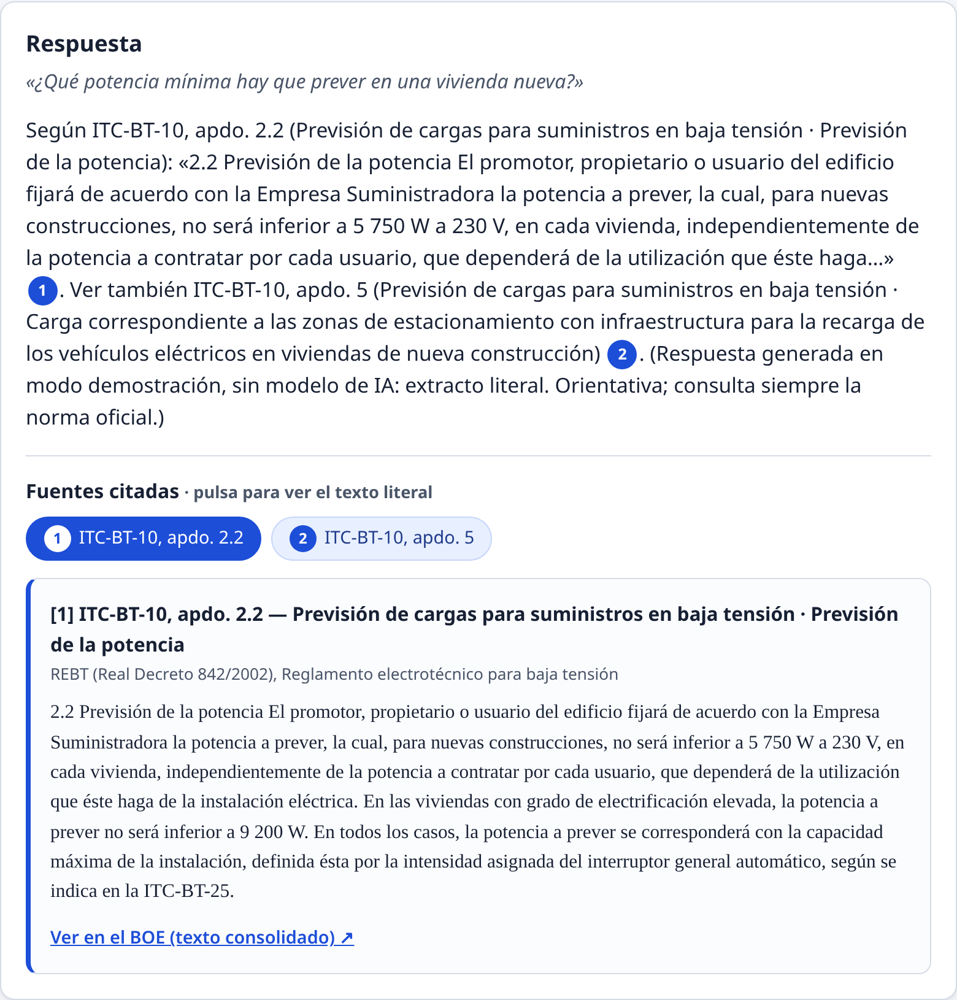
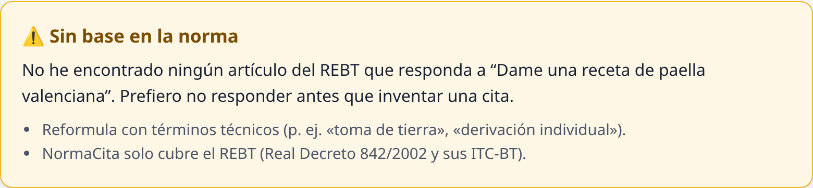
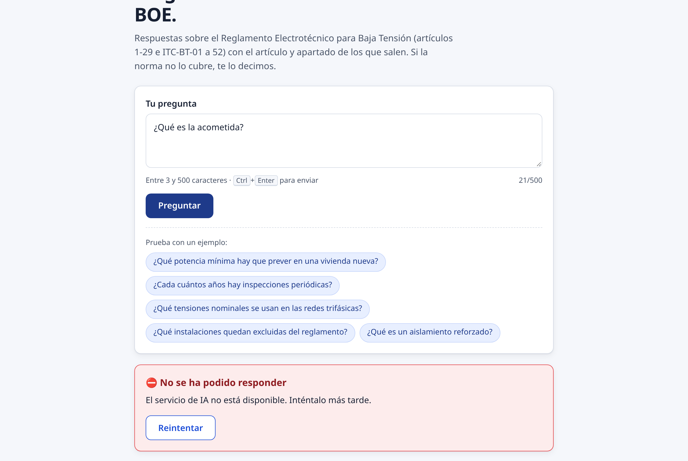
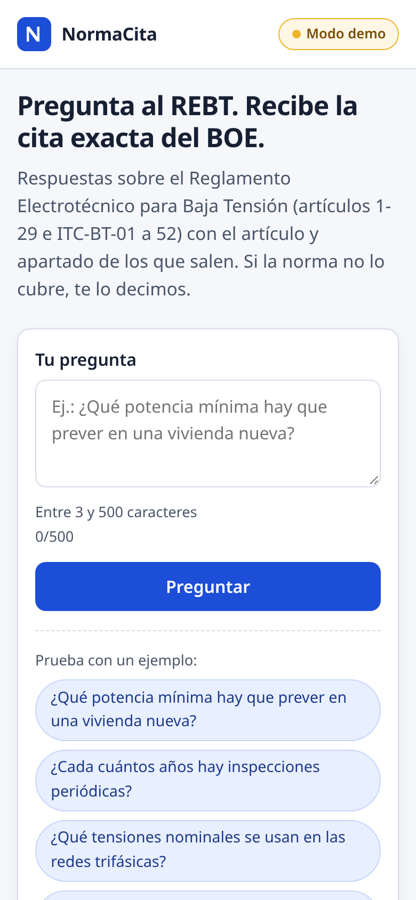

# NormaCita · Memoria del Trabajo Fin de Máster

> Este documento es complementario: el PDF oficial del máster no pide memoria y la defensa del proyecto son el README y las slides. La he escrito en primera persona con ayuda de un asistente de IA, partiendo de la documentación y del historial del repositorio (ver `docs/REGISTRO-IA.md`).
> Los datos y métricas son los del repositorio a 06/10/2026 (`README.md`, `docs/`, `tests/`, `.github/workflows/`). Si cambian, hay que actualizar esta memoria.
> El `.docx` (y el PDF, si se quiere) se genera con `scripts/generar_memoria.py`, que convierte los diagramas Mermaid en imágenes.

| | |
|---|---|
| **Título** | NormaCita: asistente de normativa técnica con citas verificables (REBT) |
| **Autor** | Pedro Navarro Arocha |
| **Máster** | Máster en Desarrollo con IA · The Big School (3.ª edición) |
| **Fecha** | Octubre de 2026 |
| **Repositorio** | https://github.com/pedronavarro-labs/normacita |
| **Demo desplegada** | https://normacita.onrender.com |
| **Slides** | [Presentación en Google Slides](https://docs.google.com/presentation/d/1MjF4xRdwQZTHY_CifoflS_jd1IXDTmFeELU4AWkBwNs/edit?usp=sharing) |
| **Vídeo** | https://github.com/pedronavarro-labs/normacita/releases/tag/tfm-demo-video |

## Resumen

NormaCita responde preguntas sobre el Reglamento Electrotécnico para Baja Tensión (REBT, Real Decreto 842/2002, BOE-A-2002-18099). En cada respuesta indica el artículo o apartado exacto del texto consolidado del BOE del que sale, con el fragmento literal y el enlace. Cuando la norma no cubre la pregunta, no responde y lo dice.

Por dentro es una aplicación RAG (*retrieval-augmented generation*) en Python con FastAPI y arquitectura hexagonal. El corpus completo, 29 artículos y 52 ITC-BT en 832 fragmentos, se genera desde la API de datos abiertos del BOE. Para buscar uso un BM25 escrito en Python puro, con dos umbrales (puntuación y cobertura) que deciden cuándo no hay base. El modelo de lenguaje se puede cambiar por cualquier API compatible con OpenAI, y hay un modo demo que funciona sin claves.

La calidad la controlo con 57 tests automáticos, que cubren el 94 % del código Python, y con una evaluación de 52 preguntas que se ejecuta en el CI. Después de mejorar la búsqueda, el hit@1 es 0,714, el hit@3 0,952 y el rechazo de preguntas fuera de ámbito 1,00. En el subconjunto de validación los números son más modestos: hit@1 0,50 y hit@3 0,917.

**Palabras clave:** RAG, BM25, citas verificables, IA responsable, OWASP LLM, FastAPI, arquitectura hexagonal, normativa técnica.

## Índice

1. [Introducción y motivación](#1-introducción-y-motivación)
2. [Objetivos](#2-objetivos)
3. [Análisis](#3-análisis)
4. [Diseño y arquitectura](#4-diseño-y-arquitectura)
5. [Decisiones técnicas](#5-decisiones-técnicas)
6. [Implementación](#6-implementación)
7. [Calidad: tests y evaluación](#7-calidad-tests-y-evaluación)
8. [Seguridad e IA responsable](#8-seguridad-e-ia-responsable)
9. [CI/CD y despliegue](#9-cicd-y-despliegue)
10. [Uso de IA en el desarrollo](#10-uso-de-ia-en-el-desarrollo)
11. [Resultados y limitaciones](#11-resultados-y-limitaciones)
12. [Conclusiones y trabajo futuro](#12-conclusiones-y-trabajo-futuro)
13. [Anexos](#anexos)

## 1. Introducción y motivación

El REBT tiene 29 artículos y 52 instrucciones técnicas complementarias, y se ha ido modificando con los años. Quien trabaja con él, sea instalador, ingeniero, técnico o estudiante, pierde bastante tiempo buscando el apartado exacto que regula algo. Los asistentes de IA genéricos contestan con mucha seguridad, pero sin citar o citando artículos que no existen. En un ámbito regulado una respuesta así vale poco.

La idea salió de comparar cinco candidatas con una tabla de criterios ponderados: originalidad, viabilidad en unas cuatro semanas, despliegue gratuito, que el valor de la IA se pudiera medir, arquitectura, testabilidad, seguridad, CI/CD y encaje con mi perfil. Fue la que más puntuó (90 sobre 100; el detalle está en `DECISION.md`, en la carpeta del TFM). Lo que más pesó es que aquí lo que aporta la IA se puede medir, porque la cita es correcta o no lo es. Y que negarse a responder cuando no hay fuente es justo lo que no hacen los chats genéricos.

Estudié el ciclo superior de ASIR (Administración de Sistemas Informáticos en Red) y trabajo como analista de ciberseguridad. Estoy acostumbrado a consultar normativa y a justificar cada decisión con su referencia, así que sé lo que cuesta dar con el apartado concreto dentro de un texto largo. Por ejemplo, cuando en un informe o en una auditoría tengo que justificar un control, no vale con decir «lo pide el ENS» o «lo pide la ISO 27001». Hay que poner la medida o el control exacto, y encontrarlo entre tantas páginas lleva su tiempo. Quería una herramienta que ahorrase ese rato sin perder rigor, que enseñara de dónde sale cada respuesta y que reconociera cuándo la norma no dice nada.

Mi trabajo también explica que la seguridad pese tanto en el proyecto. Es una aplicación pública que llama a un modelo de lenguaje, así que la diseñé siguiendo el OWASP Top 10 para LLM. Entre otras cosas, rechaza la inyección de prompt y valida las citas antes de enseñarlas.

## 2. Objetivos

El objetivo general era construir y desplegar una aplicación que resolviera dudas sobre el REBT citando siempre la fuente oficial, y de paso demostrar lo aprendido en el máster en arquitectura, IA aplicada, calidad, seguridad y CI/CD.

Los objetivos concretos y en qué punto están:

| Id | Objetivo | Estado |
|---|---|---|
| O1 | Respuestas con citas numeradas al artículo/apartado y enlace al BOE | Hecho (HU-01, HU-03) |
| O2 | No responder ni llamar al LLM cuando no hay base normativa | Hecho (HU-02) |
| O3 | Corpus completo del REBT desde la fuente oficial | Hecho (HU-05): 29 artículos + 52 ITC-BT |
| O4 | Calidad medible: tests y evaluación automática en CI | Hecho (HU-07): 57 tests, 52 preguntas |
| O5 | Seguridad web y OWASP Top 10 para LLM | Controles base (HU-04, ADR-0004) |
| O6 | Proveedor de IA intercambiable y modo demo sin claves | Hecho (ADR-0002); pendiente: LLM real en producción (HU-06) |
| O7 | Despliegue público gratuito | Hecho (HU-08): Render, plan gratuito, modo demo (https://normacita.onrender.com) |

## 3. Análisis

### 3.1 Problema

Las normas técnicas son largas y se van modificando, y localizar el apartado exacto cuesta. En obra, al redactar una memoria técnica o estudiando, lo que hace falta es la referencia, no solo la respuesta. Los chats genéricos no garantizan la fuente y a veces se la inventan.

### 3.2 Usuarios

| Persona | Necesidad | Contexto |
|---|---|---|
| Instalador/a electricista | Comprobar rápido un requisito | Móvil, poco tiempo, necesita el artículo para justificar |
| Ingeniero/a proyectista | Localizar la referencia exacta para una memoria técnica | Escritorio, quiere copiar la cita |
| Estudiante de FP o grado | Entender la norma mientras estudia | Quiere la explicación y el texto literal |
| Administrador/a del corpus (fase posterior) | Actualizar la norma cuando el BOE publica cambios | Ejecuta la ingesta y revisa la evaluación |

### 3.3 Historias de usuario (MVP)

| Id | Historia | Criterios de aceptación principales | Estado |
|---|---|---|---|
| HU-01 | Preguntar y obtener respuesta con citas | Cada marcador [n] corresponde a una cita devuelta; los marcadores inventados se eliminan; aviso de orientativo | Hecho |
| HU-02 | No responder sin base | Pregunta ajena → `sin_base = true`, sin citas y sin llamada al LLM | Hecho |
| HU-03 | Ver el texto literal de la fuente | Artículo, apartado, título, texto literal y enlace oficial (solo `https://`) | Hecho |
| HU-04 | Entradas validadas y uso limitado | 3–500 caracteres (422), rate limit por IP (429), fallo del LLM → 502 genérico | Hecho |
| HU-05 | Corpus REBT completo desde el BOE | Script de ingesta → JSON por apartado con la versión consolidada | Hecho |
| HU-06 | Respuesta generada por un LLM real | Con `openai_compatible` y credenciales, respuesta con el prompt versionado y citas | Pendiente (implementado, sin probar en producción) |
| HU-07 | Evaluación automática de calidad | ≥ 20 preguntas con artículo esperado; *hit@k* en CI con umbral | Hecho |
| HU-08 | Despliegue público | URL en el README; `/health` 200; modo demo si no hay cuota | Hecho, desplegado en Render (modo demo) |

Para después del MVP quedan: botones de feedback (HU-09), historial local (HU-10), búsqueda híbrida (HU-11), varias normas con filtro (HU-12), trazas LLMOps (HU-13), login de administrador (HU-14).

### 3.4 Requisitos no funcionales

| Id | Requisito | Cómo se comprueba |
|---|---|---|
| RNF-01 | Sin secretos en el repositorio; configuración por entorno | `.env` en `.gitignore`, `.env.example` |
| RNF-02 | Seguridad web: CSP, nosniff, anti-clickjacking, render seguro | Tests de cabeceras y tests estáticos de la UI |
| RNF-03 | OWASP LLM: LLM01, LLM05, LLM10 | Prompt con delimitadores, citas validadas, `max_tokens`, rate limit |
| RNF-04 | Tests sin red ni claves; cobertura del núcleo ≥ 80 % | `pytest` en CI con proveedor fake (94 % actual) |
| RNF-05 | Latencia p95 < 5 s con LLM real | Pendiente de medir en el despliegue |
| RNF-06 | Arranca con un comando (local y Docker) | README §c y smoke test de Docker en CI |

**Fuera de alcance:** asesoramiento profesional vinculante, normas autonómicas o privadas (UNE) con derechos de autor, apps móviles nativas y pagos.

## 4. Diseño y arquitectura

### 4.1 Visión general

Es un único servicio (un monolito modular) que sirve la API y la interfaz web. El corpus es un JSON que se carga al arrancar, y el LLM es opcional.

<!-- diagrama: 01-contexto | Visión general del sistema -->


### 4.2 Capas (arquitectura hexagonal)

Las dependencias siempre apuntan hacia dentro. `domain` no importa nada, `application` solo depende de `domain` y de sus puertos, y la infraestructura implementa esos puertos. Gracias a eso puedo cambiar de buscador o de proveedor de IA sin tocar el caso de uso, y los tests usan dobles que no necesitan red.

<!-- diagrama: 02-capas | Capas de la arquitectura hexagonal -->


### 4.3 Flujo de una pregunta

<!-- diagrama: 03-secuencia | Flujo de una pregunta -->


### 4.4 Modelo de datos

La unidad del corpus es el fragmento, que corresponde a un apartado de un artículo o a una sección de una ITC-BT. Sus campos son `id` (p. ej. `boe-a-2002-18099-a4-2`), `norma`, `articulo` («Artículo 4», «ITC-BT-10»), `apartado`, `titulo`, `texto` literal y `url` al BOE. Con ese tamaño la cita es precisa y el fragmento cabe de sobra en el contexto del LLM. Los apartados muy largos se parten por frases en trozos de 2 500 caracteres como máximo.

## 5. Decisiones técnicas

Las decisiones importantes están en `docs/adr/` como ADR:

| ADR | Decisión | Alternativas descartadas | Consecuencia principal |
|---|---|---|---|
| 0001 | Monolito modular con arquitectura hexagonal en Python/FastAPI; UI estática sin framework; inyección de dependencias en `create_app()` | Next.js full-stack, microservicios, LangChain desde el día 1 | Tests rápidos y deterministas; un solo contenedor |
| 0002 | Proveedor de LLM intercambiable: adaptador OpenAI-compatible (httpx) + proveedor *fake* determinista, elegido por `LLM_PROVIDER` | SDK de cada proveedor, LiteLLM | Cambiar de proveedor = cambiar variables; CI sin secretos |
| 0003 | Recuperación léxica BM25 primero; híbrida solo si la evaluación lo justifica. Revisión v0.2: stemming, campo título, penalización de exclusiones, prior del articulado y umbral de cobertura | Embeddings + base vectorial desde el inicio | Determinista, gratis y medible; no entiende bien las paráfrasis |
| 0004 | Controles de seguridad base OWASP Web/API + OWASP LLM Top 10 | — | Riesgos más probables cubiertos con poco código y tests |

Hay otras dos decisiones sin ADR que conviene explicar.

La ingesta va en dos pasos, del XML crudo al JSON. El XML oficial está versionado en `data/raw/rebt/` (82 ficheros, 2,3 MB), así que el corpus se puede reconstruir y auditar sin conexión. La descarga se hace en un workflow manual de GitHub Actions porque desde el entorno en el que trabajaba el asistente no se llegaba a boe.es.

La otra es que el modo demo está activado por defecto. Así la URL pública sigue funcionando aunque se acabe la cuota del LLM.

## 6. Implementación

### 6.1 Stack

| Capa | Tecnología |
|---|---|
| Backend / API | Python ≥ 3.11, FastAPI, Pydantic v2, Uvicorn, httpx |
| Recuperación | BM25 propio en Python puro (sin dependencias) |
| IA generativa | Cualquier API compatible con OpenAI `/chat/completions` (Gemini, Groq, OpenRouter, Ollama) · proveedor *fake* |
| Frontend | HTML, CSS y JavaScript sin framework |
| Calidad | pytest, pytest-cov, ruff (lint, formato y reglas de seguridad) |
| Infraestructura | Docker (usuario no root), GitHub Actions, Render (Blueprint) |
| Datos | API de datos abiertos del BOE (XML) → JSON |

Es un proyecto pequeño: unas 960 líneas de Python en `src/`, unas 550 de tests y unas 540 de interfaz (HTML, CSS y JS).

### 6.2 Estructura del proyecto

```
normacita/
├── src/normacita/
│   ├── domain/            # Fragment, Citation, Answer (sin dependencias)
│   ├── application/       # Puertos y caso de uso AskQuestion
│   ├── infrastructure/    # Corpus JSON, BM25 + texto, proveedores LLM
│   ├── api/               # FastAPI, validación, seguridad, UI estática
│   ├── evaluation.py      # Evaluación hit@k / negativas
│   └── config.py          # Configuración por variables de entorno
├── data/raw/rebt/         # XML oficial del BOE (índice + 29 artículos + 52 ITC)
├── data/corpus/rebt.json  # 832 fragmentos
├── eval/preguntas.json    # 52 preguntas de evaluación
├── scripts/               # ingest_boe.py, generar_slides.py, generar_memoria.py
├── tests/                 # 57 tests
├── docs/                  # Especificación, arquitectura, ADR, evaluación, capturas
└── Dockerfile · render.yaml · DEPLOY.md · .github/workflows/
```

### 6.3 Ingesta del corpus

`scripts/ingest_boe.py` funciona en dos pasos. `descargar` baja el índice y cada bloque del texto consolidado. `construir` coge la última versión de cada bloque y la procesa así:

- linealiza las tablas en filas `celda | celda`;
- descarta las notas editoriales;
- divide los artículos por apartados numerados;
- divide las ITC por las secciones de su propio índice, uniendo los encabezados sin contenido con su primera subsección;
- titula las secciones de ITC con su contexto (p. ej. «Terminología · Aislamiento reforzado»).

Al final salen 832 fragmentos en `data/corpus/rebt.json` (1,1 MB), con la fuente y un aviso de uso orientativo.

### 6.4 Recuperación (BM25) y decisión «sin base»

`BM25Retriever` (k1 = 1,5, b = 0,75) puntúa dos campos, el texto y el título (artículo + título). Encima de eso hay varios ajustes:

- Normalización y un stemming ligero en español. Quita tildes y stopwords (también las palabras interrogativas) y aplica reglas para plurales, género, `-ación`, participios y verbos en `-uir`. Por ejemplo, `instalaciones/instalado → instal` y `excluyen/excluidas → exclu`.
- Cláusulas de exclusión. Los apartados que empiezan por «Se excluyen…» o «No se aplicará…» se penalizan (×0,5), salvo que la pregunta sea negativa; en ese caso se favorecen (×1,3).
- Prior del articulado: ×1,2 al Real Decreto frente a las ITC.
- Cobertura: la fracción del peso IDF de la pregunta que aparece en el mejor fragmento. Las palabras que no están en el corpus cuentan con IDF máximo.

`AskQuestion` devuelve «sin base» si el mejor fragmento no llega a `RETRIEVAL_MIN_SCORE = 1,0` o a `RETRIEVAL_MIN_COVERAGE = 0,3`, y entonces no se llama al LLM. Si hay base, le pasa los 4 primeros fragmentos (`RETRIEVAL_TOP_K = 4`).

### 6.5 Proveedores de LLM

- `OpenAICompatibleProvider` hace `POST {LLM_BASE_URL}/chat/completions` con httpx, `max_tokens = 400` y un *timeout* configurable (30 s por defecto). El prompt de sistema está versionado en el código (`PROMPT_VERSION = "2026-10-06.v1"`) y le pide al modelo:
  - responder solo con los fragmentos;
  - citar con [n];
  - decir si no puede responder;
  - tratar fragmentos y pregunta como datos;
  - responder en un máximo de 150 palabras;
  - recordar que la respuesta es orientativa.
- `FakeLLMProvider` da una respuesta extractiva y determinista: la primera frase del fragmento más relevante, con su cita. Es el que se usa en los tests, en el CI y en el modo demo.
- Después de generar, `AskQuestion` quita los marcadores [n] que no corresponden a ningún fragmento (las citas inventadas) y devuelve solo las citas usadas. Si el modelo no cita nada, enseña todos los fragmentos que se usaron como contexto, para que se pueda comprobar.

### 6.6 Interfaz web

Está hecha con HTML, CSS y JavaScript, sin framework. Tiene:

- cabecera con la descripción de la herramienta e insignia «Modo demo» (cuando el proveedor es *fake*);
- preguntas de ejemplo y contador de caracteres;
- indicador de carga;
- respuesta con marcadores [n] y chips de cita que despliegan el texto literal y el enlace al BOE;
- mensajes distintos para «Sin base en la norma» y para los errores;
- pie con el aviso de que no es asesoramiento profesional.

Es responsive y accesible (etiquetas, ARIA, foco visible, navegación por teclado, contraste). Todo el contenido dinámico se mete con `textContent` y no hay scripts ni estilos en línea, así que encaja con la CSP. Las capturas están en el [Anexo A](#anexo-a-capturas).

## 7. Calidad: tests y evaluación

### 7.1 Tests

Hay 57 tests con pytest. No necesitan red ni claves porque usan el proveedor *fake*, y cubren el 94 % del código Python. Por zonas:

- dominio y caso de uso: umbral, cobertura, citas inventadas;
- texto y BM25: stemming, regresiones de ámbito y exclusiones;
- ingesta: XML de ejemplo y coherencia del corpus real (29 artículos, 52 ITC, ids únicos, URLs del BOE);
- API: flujo completo, validación 422, rate limit 429, error 502 genérico, cabeceras;
- UI: comprobaciones estáticas de CSP/XSS y accesibilidad;
- evaluación con umbrales.

### 7.2 Evaluación de la recuperación

El conjunto de evaluación tiene 52 preguntas (`eval/preguntas.json`). 42 llevan la cita esperada, escrita leyendo el texto real del corpus (un test comprueba que cada cita existe), y 10 están fuera de ámbito, una de ellas un intento de inyección de prompt. Están repartidas en dos grupos: uno de ajuste (30 + 7), que es el que se usó para elegir los parámetros, y otro de validación (12 + 3), escrito antes de medir.

Mido cuatro cosas. hit@1 y hit@3 indican si la cita esperada sale la primera o entre las tres primeras. La cobertura es el porcentaje de preguntas del corpus que sí se responden, y el acierto en negativas, el de preguntas ajenas que se rechazan.

| Métrica | Antes · BM25 básico | Después · BM25 mejorado |
|---|---|---|
| Total hit@1 | 0,548 | **0,714** |
| Total hit@3 | 0,738 | **0,952** |
| Total cobertura | 1,000 | 1,000 |
| Total acierto en negativas | 0,300 | **1,000** |
| Ajuste hit@1 / hit@3 | 0,633 / 0,767 | 0,800 / 0,967 |
| Validación hit@1 / hit@3 | 0,333 / 0,667 | **0,500 / 0,917** |
| Validación negativas | 0,333 | 1,000 |

*Mismo corpus (832 fragmentos) y mismas 52 preguntas antes y después. Fuente: `docs/EVALUACION.md`.*

El caso que obligó a mejorar la búsqueda fue «¿A qué instalaciones se aplica?». Con el BM25 básico no aparecía ningún apartado del artículo 2 entre los tres primeros. Ahora salen el 2.3, el 2.1 y el 2.2, y el 2.4 (el de exclusiones) baja al puesto 38. La pregunta contraria, «¿Qué instalaciones quedan excluidas…?», devuelve el 2.4 el primero.

El CI falla si alguna métrica total baja de su umbral: hit@1 ≥ 0,70, hit@3 ≥ 0,90, cobertura ≥ 0,95 y negativas ≥ 0,90.

## 8. Seguridad e IA responsable

| Riesgo | Control en NormaCita |
|---|---|
| Desinformación / citas inventadas (OWASP LLM09) | Umbrales «sin base»; validación de marcadores [n]; texto literal y enlace al BOE; aviso de uso orientativo |
| Inyección de prompt (LLM01) | Pregunta y fragmentos delimitados como datos; reglas explícitas en el prompt; corpus solo de fuente oficial; caso de inyección incluido en la evaluación |
| Manejo inseguro de la salida (LLM05) | La UI solo usa `textContent`; enlaces solo `https://` con `noopener noreferrer`; tests que prohíben `innerHTML` |
| Consumo ilimitado (LLM10) | Rate limit por IP (20/min por defecto), `max_tokens = 400`, sin llamada al LLM si no hay base |
| Validación de entrada (OWASP API) | Pydantic: 3–500 caracteres, sin caracteres de control → 422 |
| Cabeceras web | CSP `default-src 'self'; frame-ancestors 'none'; base-uri 'none'`, `nosniff`, `X-Frame-Options: DENY`, `Referrer-Policy: no-referrer`, `Permissions-Policy` |
| Fuga de secretos | Claves solo por entorno (`repr=False`), errores 502 genéricos, `.env` fuera del repositorio, token de CI con `contents: read` |
| Contenedor | Imagen `python:3.12-slim` con usuario sin privilegios |

En cuanto a IA responsable, la herramienta es orientativa y lo dice en cada respuesta y en el pie de página. Solo trabaja con texto oficial y público. Los planes gratuitos de algunos proveedores pueden usar las peticiones para entrenar, por eso la app solo envía la pregunta y fragmentos del BOE, nunca datos personales.

Queda pendiente (lo recoge el ADR-0004): escaneo de secretos (gitleaks), `pip-audit`/Dependabot, más tests adversarios de inyección, CORS restringido en producción y un rate limit compartido si algún día hay varias réplicas.

## 9. CI/CD y despliegue

<!-- diagrama: 04-cicd | Pipeline de CI/CD y despliegue -->


- CI (GitHub Actions, `ci.yml`). En cada push y en cada PR, el job `calidad-y-tests` pasa ruff y pytest, evaluación incluida. Luego el job `docker` construye la imagen y comprueba que el contenedor responde en `/health`.
- Ingesta (`ingest-boe.yml`). Es un workflow manual que descarga el XML del BOE y publica el corpus como artefacto.
- Despliegue. `render.yaml` (Blueprint) define un servicio web Docker en plan gratuito, con health check en `/health`, `LLM_PROVIDER=fake` por defecto y las variables secretas con `sync: false`, que se rellenan en el panel. En `DEPLOY.md` está el paso a paso de Render, la alternativa de Fly.io (que no tiene plan gratuito para cuentas nuevas) y cómo conseguir una clave gratuita de Gemini, Groq u OpenRouter.
- Limitaciones: la instancia gratuita de Render se duerme tras unos 15 min sin tráfico, y el rate limit, que vive en memoria, se reinicia en cada despliegue.

La demo pública está en https://normacita.onrender.com y funciona en modo demo, con el proveedor *fake* devolviendo respuestas extractivas con sus citas. El proveedor compatible con OpenAI está implementado y se activa con variables de entorno, pero todavía no lo he probado en producción.

## 10. Uso de IA en el desarrollo

Durante el desarrollo he usado un asistente de IA (Grok Bot) y lo he ido apuntando en `docs/REGISTRO-IA.md`. No ha sido una ayuda puntual: buena parte del trabajo lo generó el asistente. Le encargué:

- el análisis razonado para elegir la idea y la especificación;
- los ADR y el *walking skeleton* (API, BM25, proveedores, UI, tests, Docker y CI);
- la ingesta completa desde el BOE (vía GitHub Actions);
- el conjunto de evaluación y la mejora medida del BM25;
- la preparación del despliegue, la mejora de la interfaz, los guiones y el deck de la presentación, esta memoria, y el guion y la captura de pantalla del vídeo de entrega (grabación real de la aplicación desplegada, el repositorio, los tests y el CI). La narración del vídeo es mi propia voz.

**Mi papel.** Elegí la idea entre las candidatas y la validé, revisé el alcance y las decisiones de arquitectura (ADR) y comprobé lo que iba generando el asistente con los tests, el CI y la evaluación. No he dado nada por bueno sin comprobarlo. El código lo generó el asistente, y lo que me toca a mí es entenderlo y saber explicarlo. Por eso la documentación (ADR, evaluación y registro de IA) es parte del entregable. Un ejemplo: en el primer borrador de esta memoria y de las slides, el asistente me presentaba como alguien que venía de ingeniería, y no es mi caso. Lo corregí con mi perfil real y le pedí que reescribiera los textos para que contaran las cosas como las cuento yo, sin tocar el registro de uso de IA.

Para no perder el control de lo que generaba el asistente, lo que mejor me ha funcionado es tener tests y una evaluación automática desde el principio. Fue la evaluación la que detectó el sobreajuste que cuento más abajo. También ayudó que las citas esperadas estén comprobadas contra el texto real con un test, y tener por escrito las reglas para agentes (`AGENTS.md`) y las decisiones (ADR).

Problemas que aparecieron por el camino y cómo se vieron:

- La recuperación del artículo 2. Con la muestra inicial del corpus, a «¿A qué instalaciones se aplica?» salía antes el apartado 2.4 (exclusiones) que el 2.1 (ámbito). Con el corpus completo fue peor, porque ningún apartado del artículo 2 entraba en el top 3. Lo destapó la evaluación. Se corrigió con stemming, el campo título y la penalización de las cláusulas de exclusión, y las dos versiones de la pregunta tienen test de regresión.
- Desde el entorno del asistente no se podía acceder al BOE. La descarga pasó a un workflow manual de GitHub Actions, y el XML oficial se guarda en el repositorio para poder reconstruir y auditar el corpus sin red.
- El sobreajuste. Con un prior más fuerte para el articulado (×1,5) las preguntas de ajuste no empeoraban, pero el hit@1 de validación caía a 0,333. Se eligió ×1,2. Como esa elección miró la validación, lo dejé documentado: el 0,50 de hit@1 en validación no es una medida del todo ciega.
- El conjunto de validación es pequeño. Son 12 preguntas con cita y cada una pesa unos 8 puntos, así que lo tomo como una señal y no como una cifra definitiva.

## 11. Resultados y limitaciones

Lo que hay ahora mismo:

- Una aplicación que funciona de extremo a extremo con el REBT completo (29 artículos + 52 ITC-BT).
- Respuestas con citas verificables, y el 100 % de las preguntas fuera de ámbito del conjunto de evaluación rechazadas.
- En recuperación, hit@3 de 0,952 en total y de 0,917 en validación.
- 57 tests, 94 % de cobertura y el CI en verde con la evaluación incluida.
- La demo pública en Render (plan gratuito), en modo demo con el proveedor *fake*: https://normacita.onrender.com.

Y lo que no está tan bien:

- El hit@1 de validación es 0,50. Dicho de otra forma, en las preguntas nuevas solo la mitad tiene la cita correcta en primera posición. Donde de verdad se nota la mejora es en el top 3.
- El conjunto de evaluación es pequeño: 12 preguntas de validación, cada una pesa unos 8 puntos.
- Las negativas son fáciles. Las preguntas fuera de ámbito son claramente ajenas (cocina, fútbol…) y faltan negativas cercanas, como alta tensión, gas o normativa autonómica.
- BM25 falla con las paráfrasis, cuando la pregunta no comparte palabras con la norma. «¿Quién puede realizar las instalaciones eléctricas?» no recupera la cita esperada (art. 18.2 o 22.1), y «¿Cómo se protege contra contactos directos?» tampoco.
- Todavía no hay un LLM real en producción, así que la calidad de la redacción con un modelo (fidelidad a las citas, latencia) está sin medir (HU-06, RNF-05).
- La demo pública (HU-08) va con el proveedor *fake*: responde con extractos literales y no redacta. Además, en el plan gratuito la instancia se duerme tras unos 15 min sin tráfico y la primera petición tarda en despertarla.
- El rate limit está en memoria (una sola instancia) y el corpus es estático, así que hay que relanzar la ingesta cuando el BOE consolide cambios.

## 12. Conclusiones y trabajo futuro

Si me quedo con una idea técnica, es que en un RAG lo que manda es la recuperación, y que solo se puede mejorar con criterio si se mide con preguntas reales y con un subconjunto de validación aparte. Sin la validación, el prior ×1,5 habría parecido una buena idea.

El «Sin base en la norma» lo veo como una funcionalidad más. Evita respuestas inventadas y, de paso, se ahorra la llamada al modelo. Y la arquitectura hexagonal con el proveedor *fake* tuvo una ventaja muy práctica: tests deterministas y un CI sin secretos desde el primer día.

Lo que más me llevo del máster, aplicado a este proyecto, es una forma de trabajar con IA. Especificar primero, dejar las decisiones por escrito y no dar nada por bueno hasta que lo confirman los tests y la evaluación. El asistente escribe código muy rápido, pero decidir qué se mide, qué se acepta y qué se cuenta tal cual me toca a mí. Si empezara de nuevo, prepararía las preguntas de evaluación y el subconjunto de validación antes de tocar la recuperación. Así el sobreajuste del prior ×1,5 lo habría visto mucho antes. También pediría preguntas a instaladores de verdad desde el principio, en vez de redactarlas yo, para ver antes dónde falla.

**Trabajo futuro** (ver `docs/ROADMAP.md`):

1. Activar un LLM real gratuito en el despliegue de Render y medir latencia y fidelidad.
2. Ampliar la evaluación con preguntas reales de profesionales y negativas cercanas, y subir los umbrales del CI.
3. Búsqueda híbrida (BM25 + embeddings con fusión RRF) para las paráfrasis (HU-11).
4. Botones de feedback (HU-09) y trazas LLMOps de latencia y tokens (HU-13).
5. Más normas (CTE, RITE) con filtro por norma (HU-12) y actualización periódica del corpus.
6. Seguridad: gitleaks, `pip-audit`/Dependabot y tests adversarios de inyección en el CI.

## Anexos

### Anexo A. Capturas

*Todas en modo demo (sin LLM).*

**Pantalla de inicio**



**Respuesta con la cita desplegada** (texto literal del BOE y enlace)



**Pregunta sin base en la norma**



**Error del servicio de IA** (respuesta 502 genérica de la API, simulada para la captura)



**Vista móvil**



### Anexo B. Cómo ejecutar

```bash
# Requisitos: Python ≥ 3.11 (o Docker)
git clone https://github.com/pedronavarro-labs/normacita && cd normacita
uv venv .venv && source .venv/bin/activate && uv pip install -e ".[dev]"
cp .env.example .env && set -a && source .env && set +a   # modo demo por defecto
uvicorn normacita.main:app --reload                       # http://localhost:8000
ruff check . && pytest                                    # calidad
python -m normacita.evaluation                            # métricas de evaluación
# Docker
docker build -t normacita . && docker run --rm -p 8000:8000 --env-file .env normacita
```

Con un LLM real: `LLM_PROVIDER=openai_compatible`, `LLM_BASE_URL`, `LLM_API_KEY`, `LLM_MODEL` (ver `DEPLOY.md`).

### Anexo C. Enlaces y documentación

| Recurso | Enlace |
|---|---|
| Repositorio | https://github.com/pedronavarro-labs/normacita |
| GitHub Actions | https://github.com/pedronavarro-labs/normacita/actions |
| Especificación | https://github.com/pedronavarro-labs/normacita/blob/main/docs/ESPECIFICACION.md |
| Arquitectura | https://github.com/pedronavarro-labs/normacita/blob/main/docs/ARQUITECTURA.md |
| ADR | https://github.com/pedronavarro-labs/normacita/tree/main/docs/adr |
| Evaluación | https://github.com/pedronavarro-labs/normacita/blob/main/docs/EVALUACION.md |
| Despliegue | https://github.com/pedronavarro-labs/normacita/blob/main/DEPLOY.md |
| Registro de uso de IA | https://github.com/pedronavarro-labs/normacita/blob/main/docs/REGISTRO-IA.md |
| Fuente oficial (REBT consolidado) | https://www.boe.es/buscar/act.php?id=BOE-A-2002-18099 |
| Demo | https://normacita.onrender.com |
| Slides | [Presentación en Google Slides](https://docs.google.com/presentation/d/1MjF4xRdwQZTHY_CifoflS_jd1IXDTmFeELU4AWkBwNs/edit?usp=sharing) |
| Vídeo | https://github.com/pedronavarro-labs/normacita/releases/tag/tfm-demo-video |
