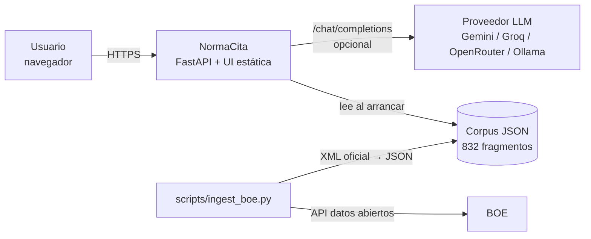
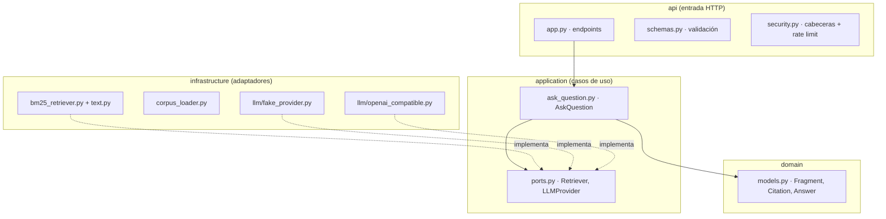
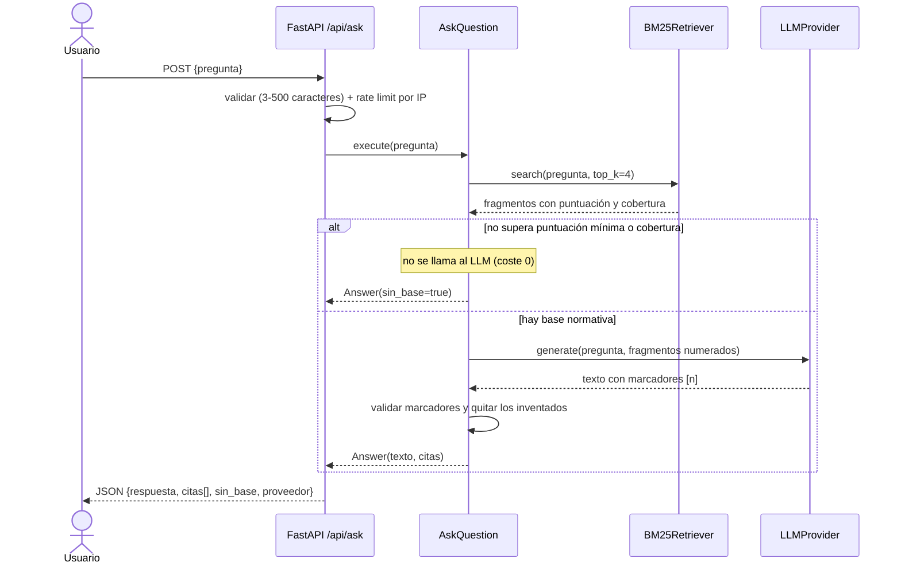
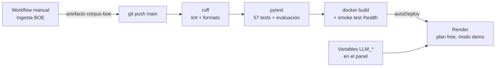

# NormaCita · Memoria del Trabajo Fin de Máster

> Documento complementario: el PDF oficial no exige memoria y la defensa del proyecto son el README y las slides. Redactado en primera persona con ayuda de un asistente de IA a partir de la documentación y el historial del repositorio (ver `docs/REGISTRO-IA.md`).
> Todos los datos y métricas salen del repositorio a fecha de 06/10/2026 (`README.md`, `docs/`, `tests/`, `.github/workflows/`). Si cambian, actualiza esta memoria.
> Este documento se regenera en `.docx` (y PDF opcional) con `scripts/generar_memoria.py`, que convierte los diagramas Mermaid en imágenes.

| | |
|---|---|
| **Título** | NormaCita: asistente de normativa técnica con citas verificables (REBT) |
| **Autor** | Pedro Navarro Arocha |
| **Máster** | Máster en Desarrollo con IA · The Big School (3.ª edición) |
| **Fecha** | Octubre de 2026 |
| **Repositorio** | https://github.com/pedronavarro-labs/normacita |
| **Demo desplegada** | https://normacita.onrender.com |
| **Slides** | {{URL_SLIDES}} |
| **Vídeo** | {{URL_VIDEO}} |

## Resumen

NormaCita responde preguntas en lenguaje natural sobre el **Reglamento Electrotécnico para Baja Tensión** (REBT, Real Decreto 842/2002, BOE-A-2002-18099). Cada respuesta va acompañada de **citas numeradas al artículo o apartado exacto** del texto consolidado del BOE, con el fragmento literal y su enlace. Si la norma no cubre la pregunta, el sistema **lo dice y no responde**.

Técnicamente es una aplicación RAG (*retrieval-augmented generation*) con arquitectura hexagonal en Python y FastAPI. El corpus completo (29 artículos y 52 ITC-BT, 832 fragmentos) se genera desde la API de datos abiertos del BOE. La búsqueda usa un BM25 propio en Python puro, con umbrales de puntuación y cobertura para decidir cuándo no hay base. El modelo de lenguaje es intercambiable (cualquier API compatible con OpenAI) y existe un **modo demo** sin claves.

La calidad se mide con 57 tests automáticos (94 % de cobertura del código Python) y una evaluación de 52 preguntas que corre en CI. Tras mejorar la búsqueda: hit@1 0,714, hit@3 0,952 y rechazo correcto de preguntas fuera de ámbito 1,00. En el subconjunto de validación, el hit@1 es 0,50 y el hit@3 0,917.

**Palabras clave:** RAG, BM25, citas verificables, IA responsable, OWASP LLM, FastAPI, arquitectura hexagonal, normativa técnica.

## Índice

1. [Introducción y motivación](#1-introducción-y-motivación)
2. [Objetivos](#2-objetivos)
3. [Análisis](#3-análisis)
4. [Diseño y arquitectura](#4-diseño-y-arquitectura)
5. [Decisiones técnicas](#5-decisiones-técnicas)
6. [Implementación](#6-implementación)
7. [Calidad: tests y evaluación](#7-calidad-tests-y-evaluación)
8. [Seguridad e IA responsable](#8-seguridad-e-ia-responsable)
9. [CI/CD y despliegue](#9-cicd-y-despliegue)
10. [Uso de IA en el desarrollo](#10-uso-de-ia-en-el-desarrollo)
11. [Resultados y limitaciones](#11-resultados-y-limitaciones)
12. [Conclusiones y trabajo futuro](#12-conclusiones-y-trabajo-futuro)
13. [Anexos](#anexos)

## 1. Introducción y motivación

Quienes trabajan con normativa técnica (instaladores, ingenieros, técnicos, estudiantes) dedican mucho tiempo a localizar **qué apartado exacto** regula algo. El REBT tiene 29 artículos y 52 instrucciones técnicas complementarias, con modificaciones a lo largo de los años. Los asistentes de IA genéricos responden con seguridad, pero sin citar o citando artículos que no existen, y en un ámbito regulado una respuesta sin fuente no sirve.

Elegí esta idea entre cinco candidatas con una tabla de criterios ponderados (originalidad, viabilidad en unas cuatro semanas, despliegue gratuito, valor medible de la IA, arquitectura, testabilidad, seguridad, CI/CD y encaje con mi perfil). Obtuvo la mayor puntuación (90 sobre 100; detalle en `DECISION.md` de la carpeta del TFM). Lo que más pesó es que **la IA aporta un valor que se puede medir** (la precisión de la cita) y que el «no respondo sin fuente» es una funcionalidad diferencial.

Mi motivación viene de mi perfil profesional: estudié el ciclo superior de ASIR (Administración de Sistemas Informáticos en Red) y trabajo como analista de ciberseguridad. Estoy acostumbrado a consultar normativa y a justificar cada decisión con su referencia, y sé lo que cuesta localizar el apartado exacto dentro de un texto largo. Quería una herramienta que ahorrase ese tiempo sin perder rigor: que no solo respondiera, sino que enseñara de dónde sale cada respuesta y que reconociera cuándo la norma no dice nada. Ese mismo perfil explica el peso de la seguridad en el proyecto: al ser una aplicación pública que llama a un modelo de lenguaje, la diseñé siguiendo el OWASP Top 10 para LLM, con rechazo de la inyección de prompt y validación de las citas.

## 2. Objetivos

**Objetivo general:** construir y desplegar una aplicación que responda dudas sobre el REBT citando siempre la fuente oficial, y que demuestre lo aprendido en el máster: arquitectura, IA aplicada, calidad, seguridad y CI/CD.

**Objetivos específicos:**

| Id | Objetivo | Estado |
|---|---|---|
| O1 | Respuestas con citas numeradas al artículo/apartado y enlace al BOE | ✅ Hecho (HU-01, HU-03) |
| O2 | No responder ni llamar al LLM cuando no hay base normativa | ✅ Hecho (HU-02) |
| O3 | Corpus completo del REBT desde la fuente oficial | ✅ Hecho (HU-05): 29 artículos + 52 ITC-BT |
| O4 | Calidad medible: tests y evaluación automática en CI | ✅ Hecho (HU-07): 57 tests, 52 preguntas |
| O5 | Seguridad web y OWASP Top 10 para LLM | ✅ Controles base (HU-04, ADR-0004) |
| O6 | Proveedor de IA intercambiable y modo demo sin claves | ✅ Hecho (ADR-0002); ⏳ LLM real en producción (HU-06) |
| O7 | Despliegue público gratuito | ✅ Hecho (HU-08): Render, plan gratuito, modo demo (https://normacita.onrender.com) |

## 3. Análisis

### 3.1 Problema

- Normas largas y modificadas: localizar el apartado exacto cuesta tiempo.
- En obra, en una memoria técnica o estudiando hace falta **la referencia**, no solo la respuesta.
- Los chats genéricos no garantizan la fuente y pueden inventarla.

### 3.2 Usuarios

| Persona | Necesidad | Contexto |
|---|---|---|
| Instalador/a electricista | Comprobar rápido un requisito | Móvil, poco tiempo, necesita el artículo para justificar |
| Ingeniero/a proyectista | Localizar la referencia exacta para una memoria técnica | Escritorio, quiere copiar la cita |
| Estudiante de FP o grado | Entender la norma mientras estudia | Quiere la explicación y el texto literal |
| Administrador/a del corpus (fase posterior) | Actualizar la norma cuando el BOE publica cambios | Ejecuta la ingesta y revisa la evaluación |

### 3.3 Historias de usuario (MVP)

| Id | Historia | Criterios de aceptación principales | Estado |
|---|---|---|---|
| HU-01 | Preguntar y obtener respuesta con citas | Cada marcador [n] corresponde a una cita devuelta; los marcadores inventados se eliminan; aviso de orientativo | ✅ |
| HU-02 | No responder sin base | Pregunta ajena → `sin_base = true`, sin citas y sin llamada al LLM | ✅ |
| HU-03 | Ver el texto literal de la fuente | Artículo, apartado, título, texto literal y enlace oficial (solo `https://`) | ✅ |
| HU-04 | Entradas validadas y uso limitado | 3–500 caracteres (422), rate limit por IP (429), fallo del LLM → 502 genérico | ✅ |
| HU-05 | Corpus REBT completo desde el BOE | Script de ingesta → JSON por apartado con la versión consolidada | ✅ |
| HU-06 | Respuesta generada por un LLM real | Con `openai_compatible` y credenciales, respuesta con el prompt versionado y citas | ⏳ (implementado, sin probar en producción) |
| HU-07 | Evaluación automática de calidad | ≥ 20 preguntas con artículo esperado; *hit@k* en CI con umbral | ✅ |
| HU-08 | Despliegue público | URL en el README; `/health` 200; modo demo si no hay cuota | ✅ desplegado en Render (modo demo) |

Después del MVP: feedback 👍/👎 (HU-09), historial local (HU-10), búsqueda híbrida (HU-11), varias normas con filtro (HU-12), trazas LLMOps (HU-13), login de administrador (HU-14).

### 3.4 Requisitos no funcionales

| Id | Requisito | Cómo se comprueba |
|---|---|---|
| RNF-01 | Sin secretos en el repositorio; configuración por entorno | `.env` en `.gitignore`, `.env.example` |
| RNF-02 | Seguridad web: CSP, nosniff, anti-clickjacking, render seguro | Tests de cabeceras y tests estáticos de la UI |
| RNF-03 | OWASP LLM: LLM01, LLM05, LLM10 | Prompt con delimitadores, citas validadas, `max_tokens`, rate limit |
| RNF-04 | Tests sin red ni claves; cobertura del núcleo ≥ 80 % | `pytest` en CI con proveedor fake (94 % actual) |
| RNF-05 | Latencia p95 < 5 s con LLM real | ⏳ Pendiente de medir en el despliegue |
| RNF-06 | Arranca con un comando (local y Docker) | README §c y smoke test de Docker en CI |

**Fuera de alcance:** asesoramiento profesional vinculante, normas autonómicas o privadas (UNE) con derechos de autor, apps móviles nativas y pagos.

## 4. Diseño y arquitectura

### 4.1 Visión general

Un **único servicio** (monolito modular) sirve la API y la interfaz web. El corpus es un JSON que se carga al arrancar. El LLM es opcional.

<!-- diagrama: 01-contexto | Visión general del sistema -->


### 4.2 Capas (arquitectura hexagonal)

Las dependencias apuntan siempre hacia dentro: `domain` no importa nada, `application` depende solo de `domain` y de sus puertos, y la infraestructura implementa esos puertos. Por eso puedo cambiar de buscador o de proveedor de IA sin tocar el caso de uso, y los tests usan dobles sin red.

<!-- diagrama: 02-capas | Capas de la arquitectura hexagonal -->


### 4.3 Flujo de una pregunta

<!-- diagrama: 03-secuencia | Flujo de una pregunta -->


### 4.4 Modelo de datos

La unidad del corpus es el **fragmento**, que corresponde a un apartado de un artículo o a una sección de una ITC-BT. Campos: `id` (p. ej. `boe-a-2002-18099-a4-2`), `norma`, `articulo` («Artículo 4», «ITC-BT-10»), `apartado`, `titulo`, `texto` literal y `url` al BOE. Con esa granularidad la cita es precisa y el fragmento cabe holgado en el contexto del LLM. Los apartados largos se trocean por frases en partes de 2 500 caracteres como máximo.

## 5. Decisiones técnicas

Las decisiones importantes están documentadas como ADR en `docs/adr/`:

| ADR | Decisión | Alternativas descartadas | Consecuencia principal |
|---|---|---|---|
| 0001 | Monolito modular con arquitectura hexagonal en Python/FastAPI; UI estática sin framework; inyección de dependencias en `create_app()` | Next.js full-stack, microservicios, LangChain desde el día 1 | Tests rápidos y deterministas; un solo contenedor |
| 0002 | Proveedor de LLM intercambiable: adaptador OpenAI-compatible (httpx) + proveedor *fake* determinista, elegido por `LLM_PROVIDER` | SDK de cada proveedor, LiteLLM | Cambiar de proveedor = cambiar variables; CI sin secretos |
| 0003 | Recuperación léxica BM25 primero; híbrida solo si la evaluación lo justifica. Revisión v0.2: stemming, campo título, penalización de exclusiones, prior del articulado y umbral de cobertura | Embeddings + base vectorial desde el inicio | Determinista, gratis y medible; no entiende bien las paráfrasis |
| 0004 | Controles de seguridad base OWASP Web/API + OWASP LLM Top 10 | — | Riesgos más probables cubiertos con poco código y tests |

Otras decisiones relevantes:

- **Ingesta en dos pasos** (XML crudo → JSON). El XML oficial se versiona en `data/raw/rebt/` (82 ficheros, 2,3 MB), así que el corpus se puede reconstruir y auditar sin red. Como desde mi entorno de desarrollo no se podía acceder a boe.es, la descarga se ejecuta en un workflow manual de GitHub Actions.
- **Modo demo por defecto**, para que la URL pública funcione aunque se agote la cuota del LLM.

## 6. Implementación

### 6.1 Stack

| Capa | Tecnología |
|---|---|
| Backend / API | Python ≥ 3.11, FastAPI, Pydantic v2, Uvicorn, httpx |
| Recuperación | BM25 propio en Python puro (sin dependencias) |
| IA generativa | Cualquier API compatible con OpenAI `/chat/completions` (Gemini, Groq, OpenRouter, Ollama) · proveedor *fake* |
| Frontend | HTML, CSS y JavaScript sin framework |
| Calidad | pytest, pytest-cov, ruff (lint, formato y reglas de seguridad) |
| Infraestructura | Docker (usuario no root), GitHub Actions, Render (Blueprint) |
| Datos | API de datos abiertos del BOE (XML) → JSON |

Tamaño aproximado: ~960 líneas de Python en `src/`, ~550 de tests y ~540 de interfaz (HTML, CSS y JS).

### 6.2 Estructura del proyecto

```
normacita/
├── src/normacita/
│   ├── domain/            # Fragment, Citation, Answer (sin dependencias)
│   ├── application/       # Puertos y caso de uso AskQuestion
│   ├── infrastructure/    # Corpus JSON, BM25 + texto, proveedores LLM
│   ├── api/               # FastAPI, validación, seguridad, UI estática
│   ├── evaluation.py      # Evaluación hit@k / negativas
│   └── config.py          # Configuración por variables de entorno
├── data/raw/rebt/         # XML oficial del BOE (índice + 29 artículos + 52 ITC)
├── data/corpus/rebt.json  # 832 fragmentos
├── eval/preguntas.json    # 52 preguntas de evaluación
├── scripts/               # ingest_boe.py, generar_slides.py, generar_memoria.py
├── tests/                 # 57 tests
├── docs/                  # Especificación, arquitectura, ADR, evaluación, capturas
└── Dockerfile · render.yaml · DEPLOY.md · .github/workflows/
```

### 6.3 Ingesta del corpus

`scripts/ingest_boe.py` tiene dos pasos. `descargar` obtiene el índice y cada bloque del texto consolidado. `construir` toma la última versión de cada bloque y la procesa así:

- linealiza las tablas en filas `celda | celda`;
- descarta las notas editoriales;
- divide los artículos por apartados numerados;
- divide las ITC por las secciones de su propio índice, uniendo los encabezados sin contenido con su primera subsección;
- titula las secciones de ITC con su contexto (p. ej. «Terminología · Aislamiento reforzado»).

Resultado: **832 fragmentos** en `data/corpus/rebt.json` (1,1 MB), con la fuente y un aviso de uso orientativo.

### 6.4 Recuperación (BM25) y decisión «sin base»

`BM25Retriever` (k1 = 1,5, b = 0,75) puntúa dos campos: el texto y el título (artículo + título). Sobre esa base:

- **Normalización y stemming ligero en español:** quita tildes y stopwords (incluidas las palabras interrogativas) y aplica reglas para plurales, género, `-ación`, participios y verbos en `-uir`. Por ejemplo, `instalaciones/instalado → instal` y `excluyen/excluidas → exclu`.
- **Cláusulas de exclusión:** los apartados que empiezan por «Se excluyen…» o «No se aplicará…» se penalizan (×0,5), salvo que la pregunta sea negativa, en cuyo caso se favorecen (×1,3).
- **Prior del articulado:** ×1,2 al Real Decreto frente a las ITC.
- **Cobertura:** fracción del peso IDF de la pregunta presente en el mejor fragmento. Las palabras ausentes del corpus cuentan con IDF máximo.

`AskQuestion` devuelve «sin base» si el mejor fragmento no alcanza `RETRIEVAL_MIN_SCORE = 1,0` o `RETRIEVAL_MIN_COVERAGE = 0,3`. En ese caso no se llama al LLM. Si hay base, pasa los 4 primeros fragmentos (`RETRIEVAL_TOP_K = 4`).

### 6.5 Proveedores de LLM

- **`OpenAICompatibleProvider`**: `POST {LLM_BASE_URL}/chat/completions` con httpx, `max_tokens = 400` y *timeout* configurable (30 s por defecto). El prompt de sistema está versionado en código (`PROMPT_VERSION = "2026-10-06.v1"`) y le exige:
  - responder solo con los fragmentos;
  - citar con [n];
  - decir si no puede responder;
  - tratar fragmentos y pregunta como datos;
  - responder en un máximo de 150 palabras;
  - recordar que la respuesta es orientativa.
- **`FakeLLMProvider`**: respuesta extractiva determinista (primera frase del fragmento más relevante con su cita). Se usa en tests, en CI y en el modo demo.
- Tras la generación, `AskQuestion` elimina los marcadores [n] que no corresponden a ningún fragmento (citas inventadas) y devuelve solo las citas usadas. Si el modelo no cita nada, muestra todos los fragmentos usados como contexto, para que se pueda verificar.

### 6.6 Interfaz web

HTML, CSS y JavaScript sin framework:

- cabecera con la propuesta de valor e insignia «Modo demo» (cuando el proveedor es *fake*);
- preguntas de ejemplo y contador de caracteres;
- estado de carga;
- respuesta con marcadores [n] y chips de cita que despliegan el texto literal y el enlace al BOE;
- estados diferenciados de «Sin base en la norma» y de error;
- pie con el aviso de que no es asesoramiento profesional.

Es responsive y accesible (etiquetas, ARIA, foco visible, navegación por teclado, contraste). Todo el contenido dinámico se inserta con `textContent`, y no hay scripts ni estilos en línea, así que es compatible con la CSP. Capturas en el [Anexo A](#anexo-a-capturas).

## 7. Calidad: tests y evaluación

### 7.1 Tests

**57 tests** con pytest, sin red ni claves (proveedor *fake*), con un **94 % de cobertura** del código Python. Cubren:

- dominio y caso de uso: umbral, cobertura, citas inventadas;
- texto y BM25: stemming, regresiones de ámbito y exclusiones;
- ingesta: XML de ejemplo y coherencia del corpus real (29 artículos, 52 ITC, ids únicos, URLs del BOE);
- API: flujo completo, validación 422, rate limit 429, error 502 genérico, cabeceras;
- UI: comprobaciones estáticas de CSP/XSS y accesibilidad;
- evaluación con umbrales.

### 7.2 Evaluación de la recuperación

Conjunto de **52 preguntas** (`eval/preguntas.json`): 42 con la cita esperada, escrita **leyendo el texto real del corpus** (un test comprueba que cada cita existe), y 10 fuera de ámbito, incluida una de inyección de prompt. Está dividido en un subconjunto de **ajuste** (30 + 7), usado para elegir parámetros, y otro de **validación** (12 + 3), escrito antes de medir.

Métricas: **hit@1** y **hit@3** (la cita esperada aparece en la primera posición o entre las tres primeras), **cobertura** (preguntas del corpus que sí se responden) y **acierto en negativas** (preguntas ajenas rechazadas).

| Métrica | Antes · BM25 básico | Después · BM25 mejorado |
|---|---|---|
| Total hit@1 | 0,548 | **0,714** |
| Total hit@3 | 0,738 | **0,952** |
| Total cobertura | 1,000 | 1,000 |
| Total acierto en negativas | 0,300 | **1,000** |
| Ajuste hit@1 / hit@3 | 0,633 / 0,767 | 0,800 / 0,967 |
| Validación hit@1 / hit@3 | 0,333 / 0,667 | **0,500 / 0,917** |
| Validación negativas | 0,333 | 1,000 |

*Mismo corpus (832 fragmentos) y mismas 52 preguntas antes y después. Fuente: `docs/EVALUACION.md`.*

El caso que motivó la mejora fue «¿A qué instalaciones se aplica?». Antes no aparecía ningún apartado del artículo 2 entre los tres primeros. Ahora salen 2.3 → 2.1 → 2.2, y el 2.4 (exclusiones) cae al puesto 38. La pregunta inversa («¿Qué instalaciones quedan excluidas…?») devuelve el 2.4 primero.

El CI falla si alguna métrica total baja de su umbral: hit@1 ≥ 0,70, hit@3 ≥ 0,90, cobertura ≥ 0,95 y negativas ≥ 0,90.

## 8. Seguridad e IA responsable

| Riesgo | Control en NormaCita |
|---|---|
| Desinformación / citas inventadas (OWASP LLM09) | Umbrales «sin base»; validación de marcadores [n]; texto literal y enlace al BOE; aviso de uso orientativo |
| Inyección de prompt (LLM01) | Pregunta y fragmentos delimitados como datos; reglas explícitas en el prompt; corpus solo de fuente oficial; caso de inyección incluido en la evaluación |
| Manejo inseguro de la salida (LLM05) | La UI solo usa `textContent`; enlaces solo `https://` con `noopener noreferrer`; tests que prohíben `innerHTML` |
| Consumo ilimitado (LLM10) | Rate limit por IP (20/min por defecto), `max_tokens = 400`, sin llamada al LLM si no hay base |
| Validación de entrada (OWASP API) | Pydantic: 3–500 caracteres, sin caracteres de control → 422 |
| Cabeceras web | CSP `default-src 'self'; frame-ancestors 'none'; base-uri 'none'`, `nosniff`, `X-Frame-Options: DENY`, `Referrer-Policy: no-referrer`, `Permissions-Policy` |
| Fuga de secretos | Claves solo por entorno (`repr=False`), errores 502 genéricos, `.env` fuera del repositorio, token de CI con `contents: read` |
| Contenedor | Imagen `python:3.12-slim` con usuario sin privilegios |

**IA responsable:** la herramienta es orientativa y lo dice en cada respuesta y en el pie. Solo usa texto oficial y público. Los planes gratuitos de algunos proveedores pueden usar las peticiones para entrenar, así que la app solo envía la pregunta y fragmentos del BOE, nunca datos personales.

Pendiente (ADR-0004): escaneo de secretos (gitleaks), `pip-audit`/Dependabot, más tests adversarios de inyección, CORS restringido en producción y rate limit compartido si hay varias réplicas.

## 9. CI/CD y despliegue

<!-- diagrama: 04-cicd | Pipeline de CI/CD y despliegue -->


- **CI (GitHub Actions, `ci.yml`)**: en cada push y PR, el job `calidad-y-tests` ejecuta ruff y pytest (evaluación incluida). Después, el job `docker` construye la imagen y comprueba que el contenedor responde en `/health`.
- **Ingesta (`ingest-boe.yml`)**: workflow manual que descarga el XML del BOE y publica el corpus como artefacto.
- **Despliegue**: `render.yaml` (Blueprint) con un servicio web Docker en plan gratuito, health check `/health`, `LLM_PROVIDER=fake` por defecto y variables secretas con `sync: false`, que se rellenan en el panel. `DEPLOY.md` documenta paso a paso Render, la alternativa Fly.io (sin plan gratuito para cuentas nuevas) y cómo obtener una clave gratuita de Gemini, Groq u OpenRouter.
- Limitaciones: la instancia gratuita de Render se duerme tras unos 15 min sin tráfico, y el rate limit en memoria se reinicia en cada despliegue.

La demo pública está en https://normacita.onrender.com. Funciona en modo demo (proveedor *fake*: respuestas extractivas con sus citas). El proveedor compatible con OpenAI está implementado y se activa con variables de entorno, pero todavía no lo he probado en producción.

## 10. Uso de IA en el desarrollo

He usado un asistente de IA (Grok Bot) durante el desarrollo y lo he registrado en `docs/REGISTRO-IA.md`. Le encargué:

- la elección razonada de la idea y la especificación;
- los ADR y el *walking skeleton* (API, BM25, proveedores, UI, tests, Docker y CI);
- la ingesta completa desde el BOE (vía GitHub Actions);
- el conjunto de evaluación y la mejora medida del BM25;
- la preparación del despliegue, la mejora de la interfaz, los guiones y el deck de la presentación, esta memoria, y el guion y la captura de pantalla del vídeo de entrega (grabación real de la aplicación desplegada, el repositorio, los tests y el CI). La narración del vídeo es mi propia voz.

Lo que funcionó para controlar el trabajo del asistente:

- **Tests y evaluación como red de seguridad:** la evaluación detectó **sobreajuste**. Con un prior más fuerte para el articulado (×1,5), las preguntas de ajuste no empeoraban, pero el hit@1 de validación bajaba a 0,333; por eso se eligió ×1,2. También quedó documentado que esa elección miró la validación.
- **Citas esperadas verificadas contra el texto real**, con un test que lo comprueba.
- **Reglas para agentes** en `AGENTS.md` y decisiones en ADR.

**Mi papel.** Elegí y validé la idea entre las candidatas, revisé el alcance y las decisiones de arquitectura (ADR) y validé el trabajo del asistente con tests, el CI y la evaluación, en lugar de dar nada por bueno sin comprobarlo. El código lo generó el asistente; mi responsabilidad es entenderlo y poder explicarlo, y por eso la documentación (ADR, evaluación y registro de IA) forma parte del entregable.

**Problemas reales que aparecieron y cómo se detectaron:**

- **Recuperación del artículo 2.** Con la muestra inicial del corpus, a «¿A qué instalaciones se aplica?» el apartado 2.4 (exclusiones) salía antes que el 2.1 (ámbito), y con el corpus completo ningún apartado del artículo 2 entraba en el top 3. Lo destapó la evaluación. Se corrigió con stemming, el campo título y la penalización de las cláusulas de exclusión, y los dos sentidos de la pregunta tienen test de regresión.
- **El BOE no era accesible desde el entorno del asistente.** La descarga se llevó a un workflow manual de GitHub Actions, y el XML oficial se versiona en el repositorio para poder reconstruir y auditar el corpus sin red.
- **Sobreajuste y honestidad de la evaluación.** El prior ×1,5 no empeoraba el subconjunto de ajuste, pero bajaba el hit@1 de validación a 0,333. Se eligió ×1,2 y quedó documentado que esa elección miró la validación, así que el 0,50 de hit@1 en validación no es una medida totalmente ciega.
- **Conjunto de validación pequeño.** Son 12 preguntas con cita, y cada una pesa unos 8 puntos. Lo trato como una señal, no como una cifra definitiva.

## 11. Resultados y limitaciones

**Resultados:**

- Aplicación funcional de extremo a extremo con el REBT completo (29 artículos + 52 ITC-BT).
- Respuestas con citas verificables y rechazo correcto del 100 % de las preguntas fuera de ámbito del conjunto de evaluación.
- Recuperación: hit@3 0,952 en total y 0,917 en validación.
- 57 tests, 94 % de cobertura y CI en verde con evaluación incluida.
- Demo pública en Render (plan gratuito) en modo demo, con el proveedor *fake*: https://normacita.onrender.com.

**Limitaciones (honestas):**

- **hit@1 de validación de 0,50:** solo la mitad de las preguntas nuevas tiene la cita correcta en primera posición. La mejora real está sobre todo en el top 3.
- **Conjunto de evaluación pequeño:** 12 preguntas de validación, así que cada pregunta pesa unos 8 puntos.
- **Negativas fáciles:** las preguntas fuera de ámbito son claramente ajenas (cocina, fútbol…). Faltan negativas cercanas (alta tensión, gas, normativa autonómica).
- **Paráfrasis:** BM25 falla cuando la pregunta no comparte palabras con la norma. Por ejemplo, «¿Quién puede realizar las instalaciones eléctricas?» no recupera la cita esperada (art. 18.2 o 22.1). «¿Cómo se protege contra contactos directos?» tampoco.
- **Sin LLM real en producción todavía:** la calidad de la redacción con un modelo real (fidelidad a las citas, latencia) no está medida (HU-06, RNF-05).
- **Demo pública en modo demo y plan gratuito** (HU-08): está desplegada en Render, pero con el proveedor *fake*, así que responde con extractos literales y no redacta. Además, la instancia se duerme tras unos 15 min sin tráfico y la primera petición tarda en despertarla.
- Rate limit en memoria (una instancia) y corpus estático: hay que relanzar la ingesta cuando el BOE consolide cambios.

## 12. Conclusiones y trabajo futuro

**Conclusiones:**

- En un RAG lo crítico es la **recuperación**, y solo se puede mejorar con criterio si se **mide** con preguntas reales y un subconjunto de validación separado.
- Un «no tengo base en la norma» bien diseñado es una funcionalidad, no un fallo: reduce el riesgo de desinformación y el coste.
- La arquitectura hexagonal y el proveedor *fake* permitieron tener tests deterministas y CI sin secretos desde el primer día.

A nivel personal, lo que más me llevo del máster aplicado a este proyecto es una forma de trabajar con IA: especificar primero, dejar las decisiones por escrito y no dar nada por bueno hasta que lo confirman los tests y la evaluación. El asistente acelera mucho la escritura de código, pero el criterio sobre qué medir, qué aceptar y qué contar con honestidad tiene que ser mío.

**Trabajo futuro** (ver `docs/ROADMAP.md`):

1. Activar un LLM real gratuito en el despliegue de Render; medir latencia y fidelidad.
2. Ampliar la evaluación: preguntas reales de profesionales y negativas cercanas; subir los umbrales del CI.
3. Búsqueda híbrida (BM25 + embeddings con fusión RRF) para las paráfrasis (HU-11).
4. Feedback 👍/👎 (HU-09) y trazas LLMOps de latencia y tokens (HU-13).
5. Más normas (CTE, RITE) con filtro por norma (HU-12) y actualización periódica del corpus.
6. Seguridad: gitleaks, `pip-audit`/Dependabot y tests adversarios de inyección en CI.

## Anexos

### Anexo A. Capturas

*Todas en modo demo (sin LLM).*

**Pantalla de inicio**


**Respuesta con la cita desplegada** (texto literal del BOE y enlace)


**Pregunta sin base en la norma**


**Error del servicio de IA** (respuesta 502 genérica de la API, simulada para la captura)


**Vista móvil**


### Anexo B. Cómo ejecutar

```bash
# Requisitos: Python ≥ 3.11 (o Docker)
git clone https://github.com/pedronavarro-labs/normacita && cd normacita
uv venv .venv && source .venv/bin/activate && uv pip install -e ".[dev]"
cp .env.example .env && set -a && source .env && set +a   # modo demo por defecto
uvicorn normacita.main:app --reload                       # http://localhost:8000
ruff check . && pytest                                    # calidad
python -m normacita.evaluation                            # métricas de evaluación
# Docker
docker build -t normacita . && docker run --rm -p 8000:8000 --env-file .env normacita
```

Con un LLM real: `LLM_PROVIDER=openai_compatible`, `LLM_BASE_URL`, `LLM_API_KEY`, `LLM_MODEL` (ver `DEPLOY.md`).

### Anexo C. Enlaces y documentación

| Recurso | Enlace |
|---|---|
| Repositorio | https://github.com/pedronavarro-labs/normacita |
| GitHub Actions | https://github.com/pedronavarro-labs/normacita/actions |
| Especificación | https://github.com/pedronavarro-labs/normacita/blob/main/docs/ESPECIFICACION.md |
| Arquitectura | https://github.com/pedronavarro-labs/normacita/blob/main/docs/ARQUITECTURA.md |
| ADR | https://github.com/pedronavarro-labs/normacita/tree/main/docs/adr |
| Evaluación | https://github.com/pedronavarro-labs/normacita/blob/main/docs/EVALUACION.md |
| Despliegue | https://github.com/pedronavarro-labs/normacita/blob/main/DEPLOY.md |
| Registro de uso de IA | https://github.com/pedronavarro-labs/normacita/blob/main/docs/REGISTRO-IA.md |
| Fuente oficial (REBT consolidado) | https://www.boe.es/buscar/act.php?id=BOE-A-2002-18099 |
| Demo | https://normacita.onrender.com |
| Slides | {{URL_SLIDES}} |
| Vídeo | {{URL_VIDEO}} |
